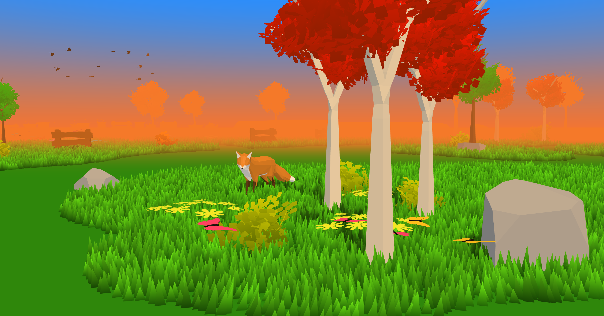
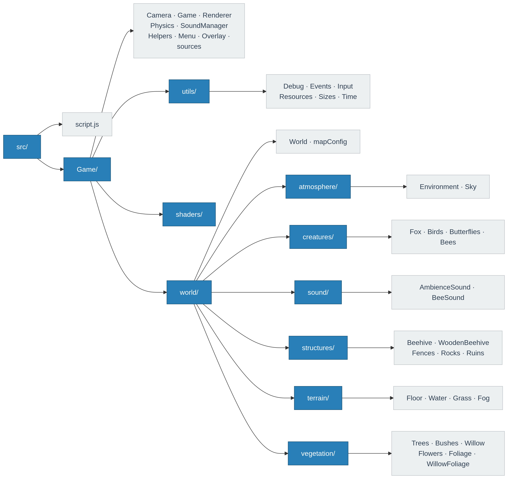

# A Little Walk

A low-poly 3D exploration game built with [Three.js](https://threejs.org/) as the final project for the Introduction to Computer Graphics course at the University of Aveiro (2026).

**Play it here:** [a-little-walk.vercel.app](https://a-little-walk.vercel.app/)  
**Demo:** [YouTube](https://www.youtube.com/watch?v=Zj4uqgWfk7Y)



## About

_A Little Walk_ is a peaceful exploration game where you control a fox wandering through an open world. There are no objectives, just exploration, and a quiet landscape to move through.

The world is populated with trees, bushes, flowers, water, ruins, fences, and ambient creatures: birds that fly overhead in formation, butterflies that drift between flowers, and bees that buzz around their hives. A custom sound system plays nature sounds in the background, with separate volume controls for ambience, bees, and birds.

> This project was submitted as the final delivery for the ICG course. Future updates may still be added.

See the [development log](./docs/DEVELOPMENT.md) for screenshots of the project's progress over time, and the [Documentation](#documentation) section for the full set of course deliveries.

## Documentation

| Milestone    | Description                                                                                                                    | Links                                                                                                             |
| ------------ | ------------------------------------------------------------------------------------------------------------------------------ | ----------------------------------------------------------------------------------------------------------------- |
| Proposal     | Initial concept: game idea, planned features, and inspiration.                                                                 | [PDF](./docs/pdfs/proposal/project-proposal.pdf)                                                                  |
| Intermediate | Mid-semester progress: implemented features so far, early screenshots, and technical notes.                                    | [PDF](./docs/pdfs/intermediate/intermediate-pdf.pdf) / [Slides](./docs/pdfs/intermediate/intermediate-slides.pdf) |
| Final        | Complete project overview: all features, shaders, textures, animations, sound system, user interaction, and code organization. | [Slides](./docs/pdfs/final/final-slides.pdf)                                                                      |

## Features

- **Fox character** with idle, walking, and running animations (GLTF model with baked animations)
- **Open world** with varied terrain shaped by a heightmap texture, atmospheric fog, and a gradient sky
- **Vegetation**: multiple tree species, bushes, a weeping willow, and a dense grass field
- **Flowers**: shader-based flowers scattered across the terrain, in multiple species and colors
- **Water**: animated water surface with a custom shader
- **Creatures**: birds flying in formation, butterflies wandering between flowers, and bees orbiting beehives
- **Structures**: fences, rocks, ruins, and two types of beehive (wooden box and straw dome)
- **Ambient sound**: three independent audio channels (ambience, bees, birds) with per-channel volume controls
- **Mobile support**: virtual joystick, run button, one-finger camera rotation, and pinch-to-zoom
- **In-game menu**: sound settings, controls reference, and credits overlay

## Controls

### Desktop

| Key / Input                  | Action          |
| ---------------------------- | --------------- |
| `W` `A` `S` `D` / Arrow keys | Move            |
| `Shift`                      | Run             |
| `Mouse drag`                 | Camera rotation |
| `Scroll`                     | Camera zoom     |
| `Esc`                        | Release mouse   |

Click anywhere on the scene to capture the mouse again.

### Mobile

| Input            | Action          |
| ---------------- | --------------- |
| Virtual joystick | Move            |
| Run button       | Run             |
| One-finger drag  | Camera rotation |
| Pinch            | Camera zoom     |

## Getting Started

### Prerequisites

- Node.js

### Install & Run

```bash
# Clone the repo
git clone git@github.com:goncalooliveirasilva/a-little-walk.git
cd a-little-walk/

# Install dependencies
npm install

# Start the dev server
npm run dev
```

Then open the URL shown by Vite (usually `http://localhost:5173`).

### Debug Mode

Append `#debug` to the URL to enable the debug UI:

```
http://localhost:5173/#debug
```

This shows [Tweakpane](https://tweakpane.github.io/docs/) controls for every system (grass, fog, trees, etc.) and FPS stats.

## Tech Stack

- [Three.js](https://threejs.org/) (3D graphics)
- [cannon-es](https://github.com/pmndrs/cannon-es) (physics)
- [Blender](https://www.blender.org/) (3D modeling)
- [Krita](https://krita.org/) (texture painting)
- [Canva](https://www.canva.com/) (texture design)
- [Tweakpane](https://tweakpane.github.io/docs/) (debug UI)
- [stats.js](https://github.com/mrdoob/stats.js) (performance stats)
- [GSAP](https://gsap.com/) (animations)
- [Vite](https://vite.dev/) (dev server and bundler)

## Code Organization

The project follows a class-based structure where each world element is its own entity. `script.js` is the entry point and instantiates the `Game` class, which owns all top-level systems (`Camera`, `Renderer`, `Physics`, `SoundManager`, etc.) and the `World`. A `utils/` module provides shared infrastructure (event emitter, input handler, resource loader, clock, etc.) used across the whole codebase.

The `shaders/` folder contains all GLSL shader files, organized by entity. The `World` creates and manages all scene entities through five subcategories: `atmosphere`, `terrain`, `vegetation`, `structures`, and `creatures`. A `sound/` subcategory handles the ambient audio sources independently. Manual mesh placement (positions, rotations, colors, and scales) for all static objects in the scene lives in `mapConfig.js`.



## Inspiration

The following games served as the main sources of inspiration: [_The First Tree_](https://www.thefirsttree.com/), for its emotional tone and low-poly forest aesthetic; [_A Short Hike_](https://ashorthike.com/), for its peaceful world and unhurried pace; [_Firewatch_](https://www.firewatchgame.com/), for the visual approach (particularly forests, atmospheric lighting, and environmental mood); [_Alba: A Wildlife Adventure_](https://ustwogames.co.uk/games/alba-a-wildlife-adventure), for the idea of interacting with nature and wildlife in a gentle way; and [_ABZÛ_](https://abzugame.com/) as a reference for exploration-driven gameplay and strong, cohesive art direction.

## Credits

Created by [Gonçalo Silva](https://github.com/goncalooliveirasilva).

**Assets:**

- Fox model by [PixelMannen](https://opengameart.org/content/fox-and-shiba) (CC0)
- Fox animations by [tomkranis](https://sketchfab.com/3d-models/low-poly-fox-by-pixelmannen-animated-371dea88d7e04a76af5763f2a36866bc) (CC BY 4.0)
- glTF conversion by the [Khronos Group](https://github.com/KhronosGroup/glTF-Sample-Models/tree/master/2.0/Fox)
- Beehive ASMR sound by [DRAGON-STUDIO](https://pixabay.com/users/dragon-studio-38165424/) via [Pixabay](https://pixabay.com/)
- Nature ambience sound by [u_vr5icvkppa](https://pixabay.com/users/u_vr5icvkppa-49666562/) via [Pixabay](https://pixabay.com/)
- Bird flock sound by [Mikhail (soundsforyou)](https://pixabay.com/users/soundsforyou-4861230/) via [Pixabay](https://pixabay.com/)
- Perlin noise texture generated with [gen3vra's Perlin Noise Generator](https://gen3vra.github.io/perlinnoisegenerator)

**Textures:**

All textures (terrain heightmap, grass density map, leaf and flower atlases) were created by me using Krita and Canva, except for the Perlin noise texture linked above.

**Fonts:**

- [Playfair Display](https://fonts.google.com/specimen/Playfair+Display) (SIL Open Font License)
- [Courier Prime](https://fonts.google.com/specimen/Courier+Prime) (SIL Open Font License)

## Use of AI

I used [Claude](https://www.anthropic.com/claude) (Anthropic) as an AI assistant during development. Below is an honest account of where it was and wasn't involved.

**Written independently, without AI:**

- Overall project architecture: the class-based structure (`Game`, `World`, `Renderer`, `Physics`, `Camera`, and all world entities), designed based on patterns from prior Three.js work
- Six of the seven custom shaders: flowers, foliage, water, sky, floor, and willow (written independently with no meaningful AI involvement)

**AI-assisted:**

- **Grass shader**: the most complex shader in the project; AI helped with parts of the implementation (density map sampling, wind effect)
- **Bird flock and butterfly animations**: AI helped design the movement logic
- **Loading screen**: AI helped with the implementation and CSS overlay
- **Mobile support**: AI helped implement the virtual joystick, touch-based camera controls, and responsive layout
- **Boilerplate and repetitive code**: AI helped generate repetitive setup code across similar world entities
- **Debugging**: AI helped diagnose and fix specific issues throughout development
- **Discussing implementation approaches and trade-offs**

All design decisions, integration into the existing project structure, tuning, and final review of the code were done by me.

## References

**General**

- [Three.js Documentation](https://threejs.org/docs/)
- [Three.js Journey](https://threejs-journey.com/)
- [Beginner Blender Tutorial](https://www.youtube.com/watch?v=z-Xl9tGqH14&t=5052s)
- [Draco 3D Compression](https://google.github.io/draco/)

**Grass and Bushes**

- [Infinite Grass](https://www.youtube.com/watch?v=cesPK0kYkyE&t=360s)

**Models**

- [Stylized Beehive](https://www.youtube.com/watch?v=aM_3b32z8uA)
- [Creating a Flock of Low-Poly Birds](https://www.youtube.com/watch?v=eSL98LLr1kw&t=913s)
- [Animated Butterflies](https://www.youtube.com/watch?v=DWJ5Wn0Dg7U)
